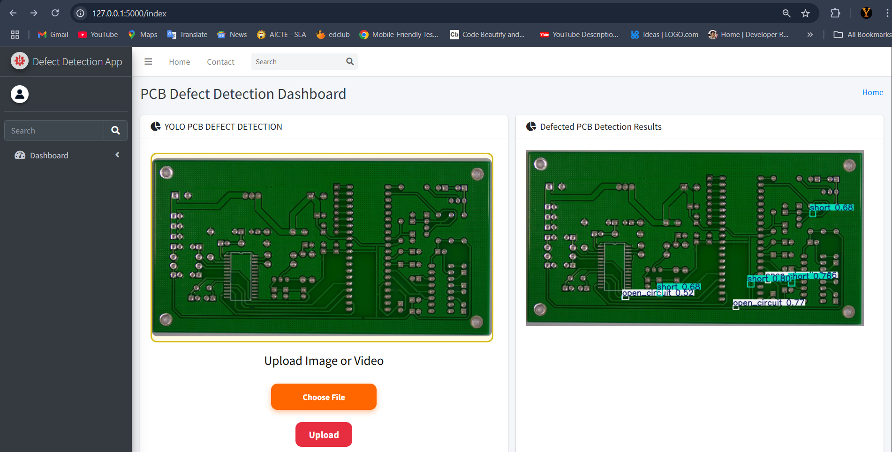
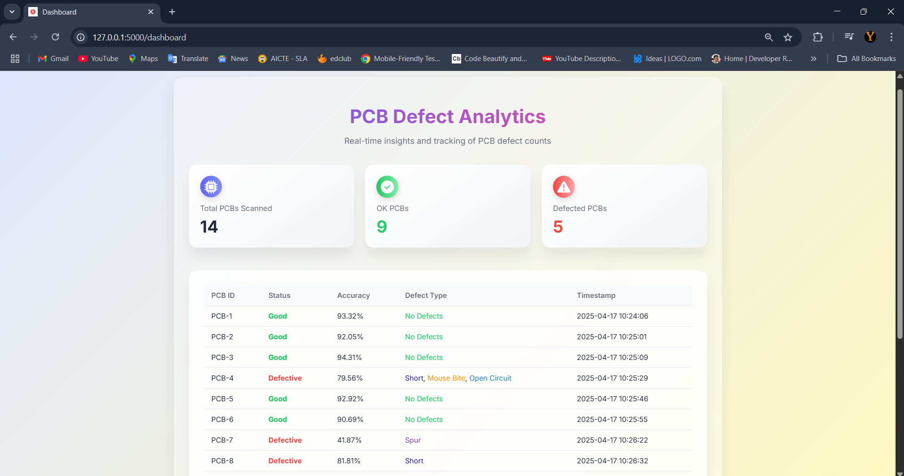
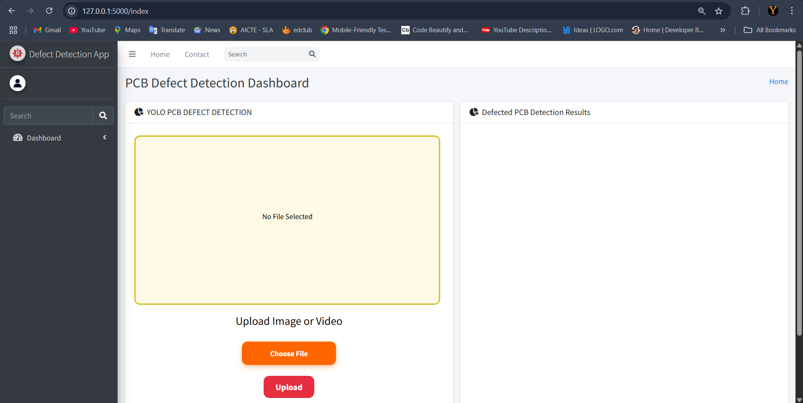

# 🧠 Automated PCB Defect Detection System

An AI-powered web app to detect PCB defects using YOLOv8 with Flask backend.

## 🔍 Sample Detection


## 📊 Analytics Dashboard


## 🖼️ Upload Interface


An AI-powered web application designed to automatically detect defects in Printed Circuit Boards (PCBs) using YOLO (You Only Look Once) object detection models. Built with a modular Flask backend and a responsive frontend, the system supports real-time webcam input, image/video uploads, detailed analytics, and an interactive dashboard.

## 🚀 Features

- 🧠 **YOLOv8-based Detection**: Real-time PCB defect detection using advanced computer vision.
- 📷 **Multi-Source Input**: image files, and video uploads.
- 📊 **Live Dashboard**: View total scanned PCBs, defected and OK counts, and detection accuracy.
- 📝 **Analytics & Reports**:
  - Auto-updating Analytics.
  - Stores defected images with labels for audit and improvement.
- 👤 **User Auth**: Secure login/registration system with role-based access.
- ♻️ **Reset Functionality**: Reset counters and analytics data on demand.

## 🛠️ Tech Stack

**Frontend:**
- HTML, CSS, JavaScript
- sessionStorage for temporary file preview

**Backend:**
- Python, Flask
- OpenCV for video/image handling
- YOLOv8 (PyTorch)
- MySQL for storing user/auth/data


## 🧪 How to Run

1. **Clone the repo**
```bash
git clone https://github.com/yogesh032003/Automated-PCB-Defect-Detection-System.git
cd Automated-PCB-Defect-Detection-System
python webapp.py

